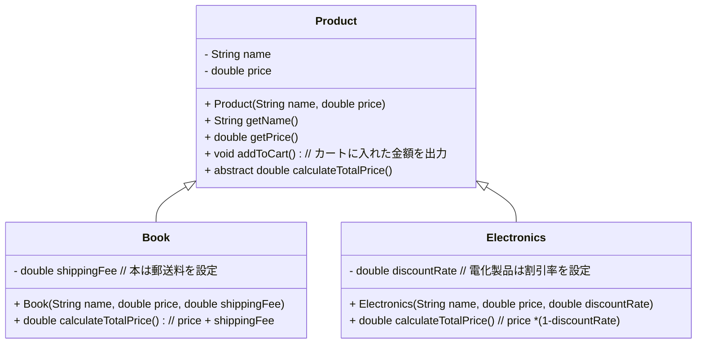
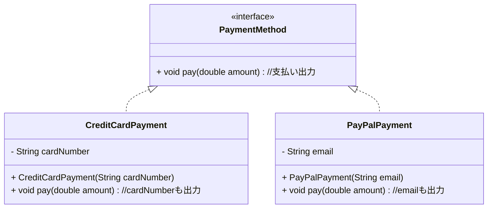

# abstract, interfaceを用いた例

## ECサイトを例に（シナリオ）
1.	ECサイトでは、異なる商品タイプ（例：本、電子製品、衣服）を扱います。
2.	各商品タイプには共通のプロパティ（名前、価格、購入機能）がありますが、送料や割引のルールが異なります。
3.	支払い方法（例：クレジットカード、PayPal）は複数種類あり、それぞれ異なる処理を持ちます。

## クラス図
- Product クラスは共通の属性とメソッドを持つ抽象クラス。
- Book と Electronics は Product を継承し、それぞれ固有の価格計算ロジックを実装。
- PaymentMethod はインターフェースで、CreditCardPayment と PayPalPayment が実装。

